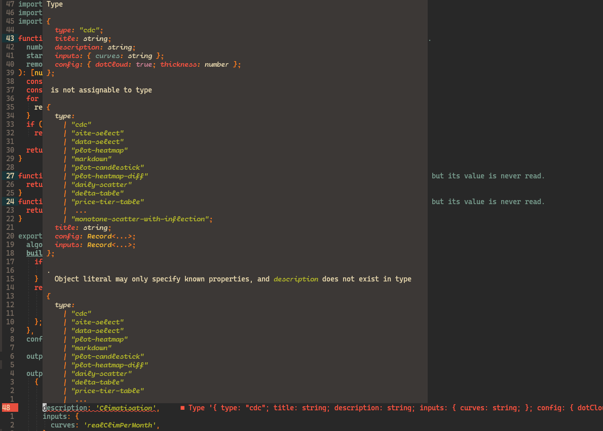
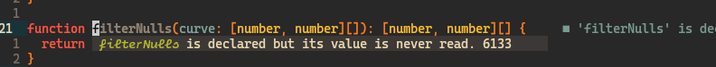

# format-ts-errors.nvim

A very simple Neovim plugin to format TypeScript errors.

## How it looks




## Requirements

This plugin uses `prettier` to format the types.

## Installation

Using Lazy.nvim:
```lua
{
    'z0rzi/format-ts-errors.nvim',
    dependencies = {
        'nvim-treesitter/nvim-treesitter' -- For types highlighting, optional
    },
    config = function()
        require('format-ts-errors').setup({
            prettier_path = "prettier",
            mappings = {
                show_diagnostic = "L", -- Show the diagnostic under the cursor
                goto_next = ";j", -- Go to the next diagnostic
                goto_prev = ";k", -- Go to the previous diagnostic
            },
        })

        -- Optional, to enable highlighting of the types (requires treesitter)
        vim.g.markdown_fenced_languages = { 'typescript' }
    end,
},
```


## How it works

This plugin uses the `format` option of the `vim.diagnostic.open_float` function, to:

1. Get the diagnostic message
2. Identify the parts of the message which are types
3. Format the types using `prettier`
4. Place the formatted types in markdown code blocks
5. Send the formatted message to the native `vim.diagnostic.open_float`
